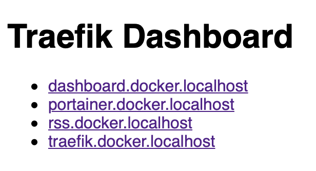

traefik-dashboard
===

> the missing links dashboard for traefik deployments 



# Installation

**[goreleaser](https://goreleaser.com/) required**

```
git clone https://github.com/iwittkau/traefik-dashboard.git
cd traefik-dashboard
make snapshot
make run-docker
``` 

`traefik` should be deployed as a Docker container with the name `traefik` and the network `traefik_proxy`. Modify as needed.